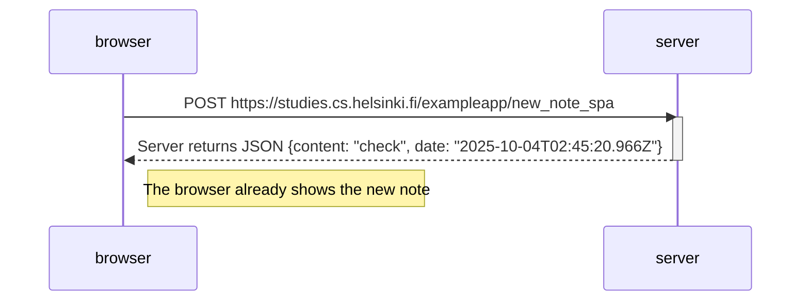

```mermaid
sequenceDiagram
    participant browser
    participant server

    browser->>server: POST https://studies.cs.helsinki.fi/exampleapp/new_note_spa
    activate server
    server-->>browser: Server returns JSON {content: "check", date: "2025-10-04T02:45:20.966Z"}
    deactivate server

    Note right of browser: The browser already shows the new note

```